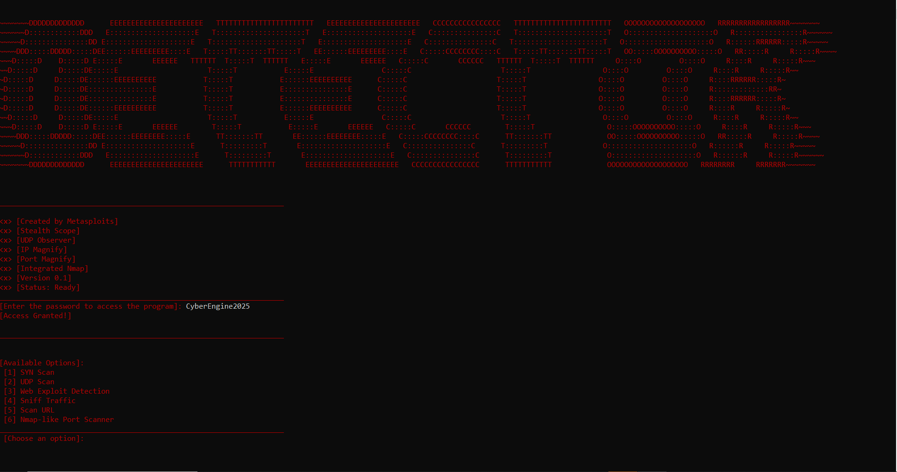
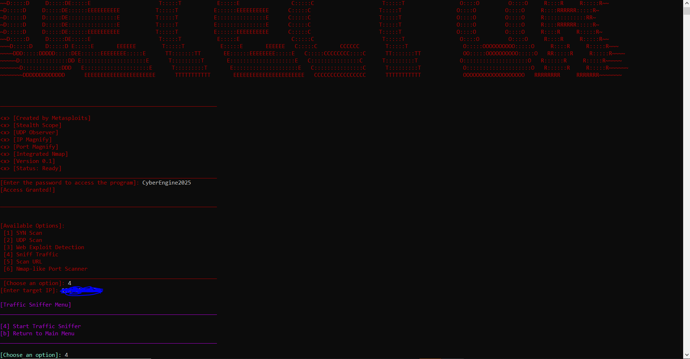
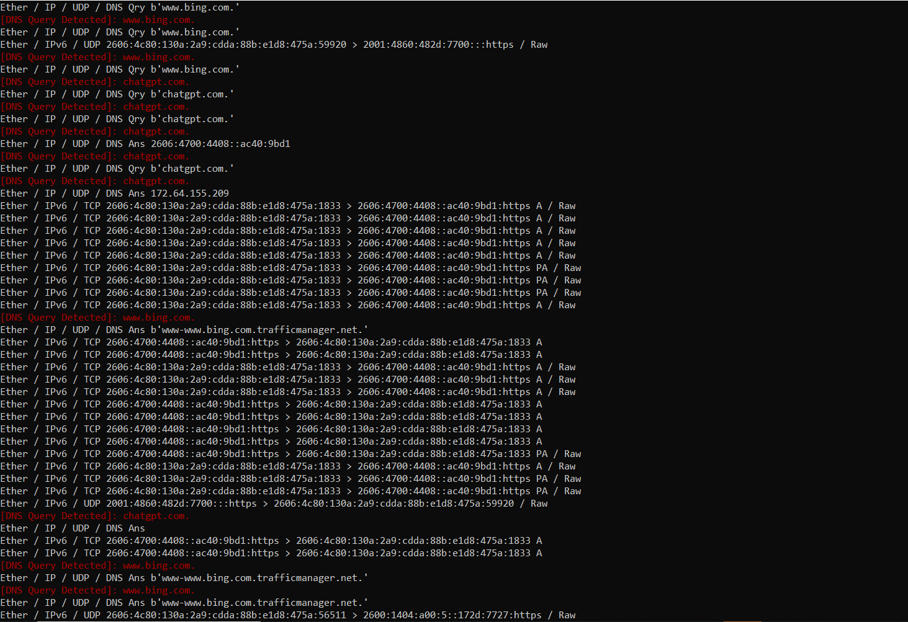
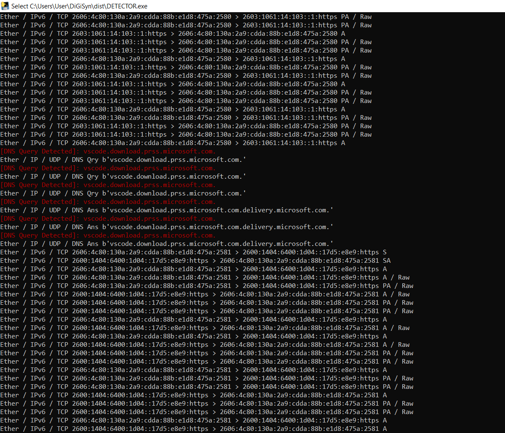

# Network Detection Script

---

## Objective

The objective of this project was to build and test a terminal-based network detection tool for observing traffic on systems and networks that I was authorized to monitor.

The program presents several security-testing options, including SYN scanning, UDP scanning, web-exploit detection, packet sniffing, URL scanning, and an Nmap-style port scanner. The screenshots documented here focus on the traffic-sniffer workflow. During testing, the tool displayed Ethernet, IPv4, IPv6, TCP, UDP, and DNS packet information and highlighted detected DNS queries so that network activity could be reviewed in real time.

I tested the tool against my own machine and Wi-Fi environment. The goal was to learn how ordinary application activity appears at the packet level and how a detection script can separate useful indicators, such as DNS queries, from a larger stream of traffic.

This project was used only on systems and network traffic that I owned or had permission to inspect.

---

## Skills Learned

- Built and tested a menu-driven network security utility.
- Captured live Ethernet, IPv4, and IPv6 traffic.
- Identified TCP and UDP packet flows.
- Parsed and highlighted DNS queries and responses.
- Compared domain-name activity with surrounding network packets.
- Observed TCP flags such as SYN, ACK, and PSH/ACK.
- Tested packet capture against my own machine and Wi-Fi network.
- Improved understanding of how browser and application activity generates DNS and HTTPS traffic.
- Practiced separating useful detection events from noisy packet output.
- Learned to remove passwords and sensitive targets from public security documentation.

---

## Tools Used

- Python-based network detection script
- Packet-sniffing libraries
- DNS packet parsing
- TCP and UDP analysis
- IPv4 and IPv6 observation
- Nmap integration
- Windows command-line environment
- Local Wi-Fi test network

---
## Title

## Showcase (Option: Sniffing Traffic)

## Steps

Every published screenshot includes a short explanation of what is being shown. Screenshots that displayed the program's access password were intentionally excluded from the public portfolio.

### Ref 1: DNS and Packet Detection

This screenshot shows the detector processing live traffic and highlighting DNS queries for domains used during the test. The surrounding output displays Ethernet, IPv4, IPv6, TCP, UDP, DNS query, and DNS answer layers, allowing the highlighted domain activity to be reviewed in context.

---

### Ref 2: Scanning Local Machine Activity

This screenshot shows the detector observing traffic generated by the local machine. The tool identifies DNS activity related to a Visual Studio Code download service and displays the associated IPv6 HTTPS packet flow and TCP flags.

---

## My Contribution

My main contributions were:

- Worked on the terminal-based network detection program and its menu workflow.
- Tested the packet-sniffing function on my own machine and Wi-Fi environment.
- Reviewed Ethernet, IP, TCP, UDP, and DNS packet output.
- Added visible DNS-query detection to make domain activity easier to identify.
- Compared detected DNS events with the surrounding transport-layer traffic.
- Documented the tool's output while excluding screenshots that exposed an access password.

---

## Summary

This project helped me understand how a network detection tool converts raw packet traffic into information that an analyst can review. The DNS highlights made it easier to connect application behavior with domain lookups, while the TCP and UDP output showed the larger communication flow around those events.

Testing the program on my own system also reinforced the importance of authorization, privacy, and careful evidence handling when capturing network traffic.
