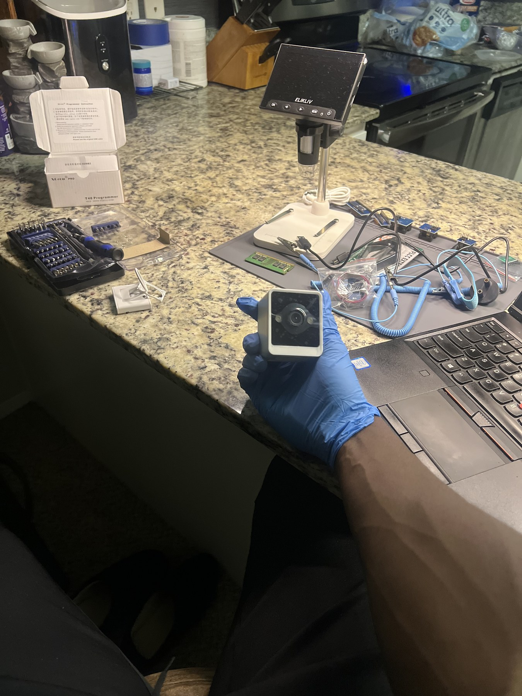
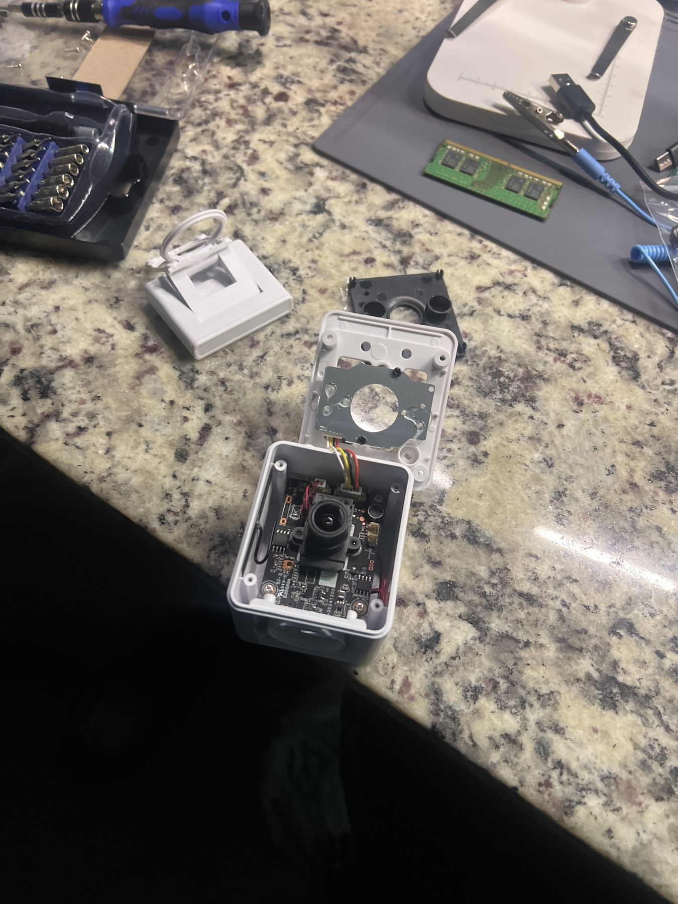
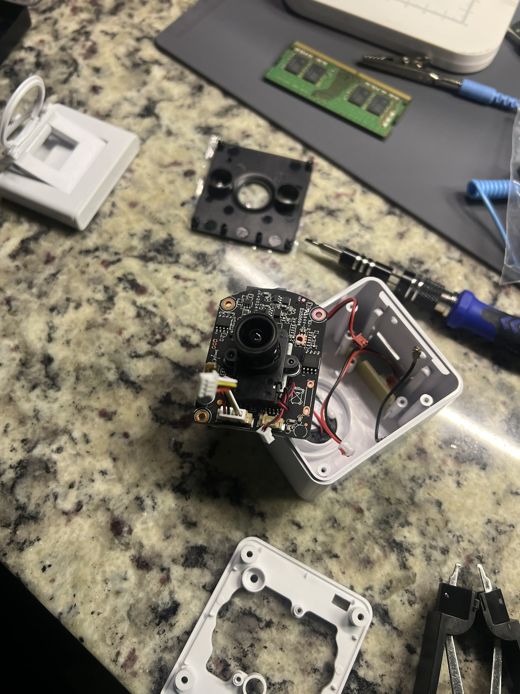
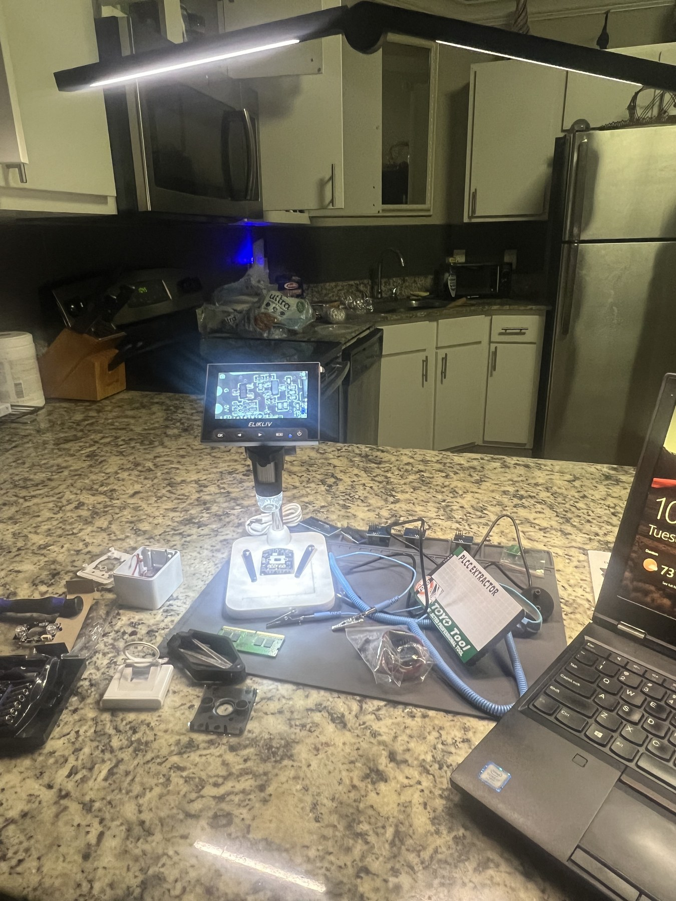
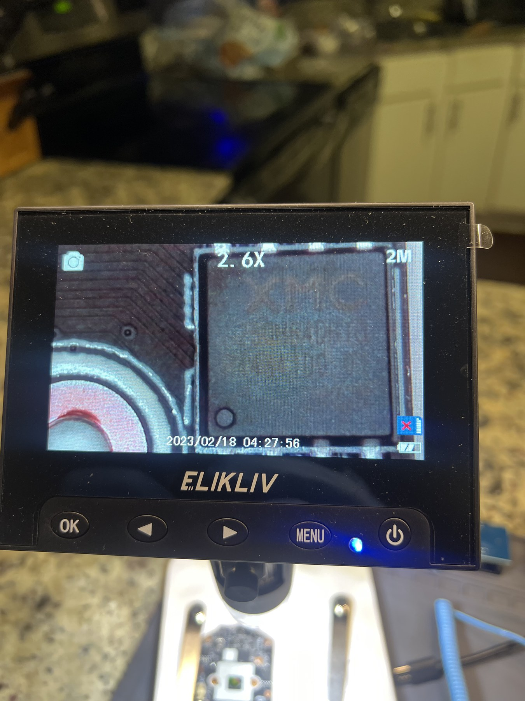
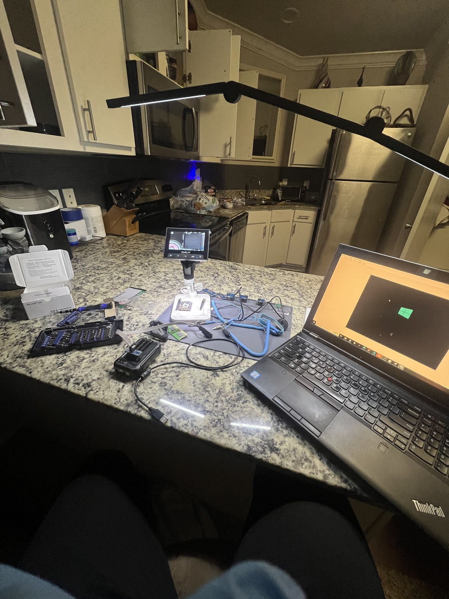
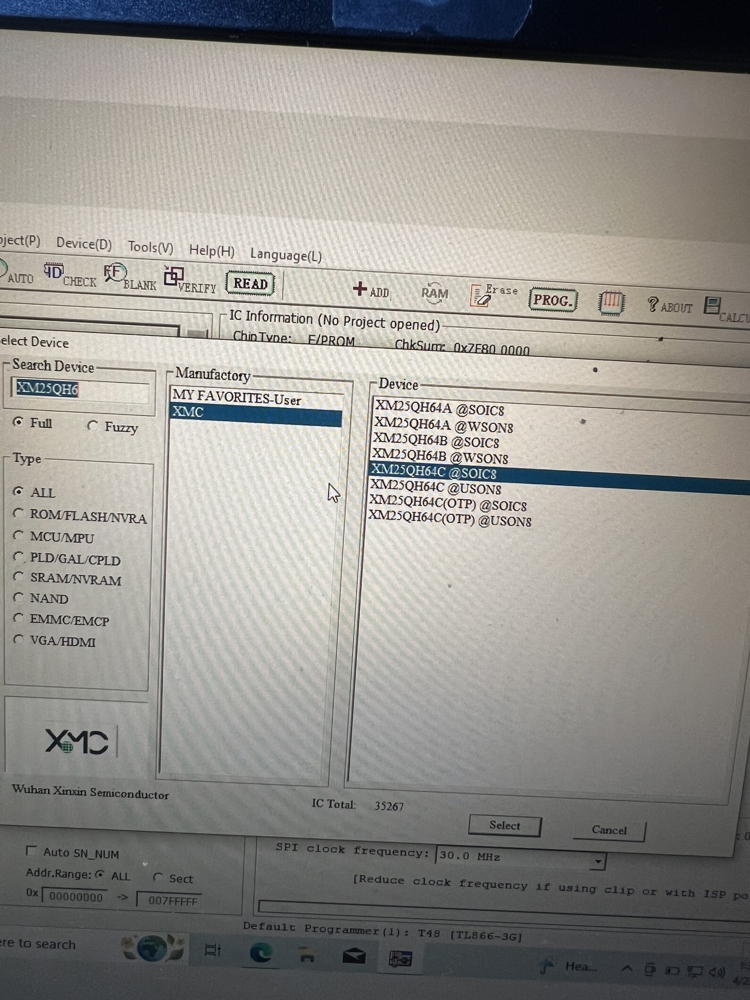
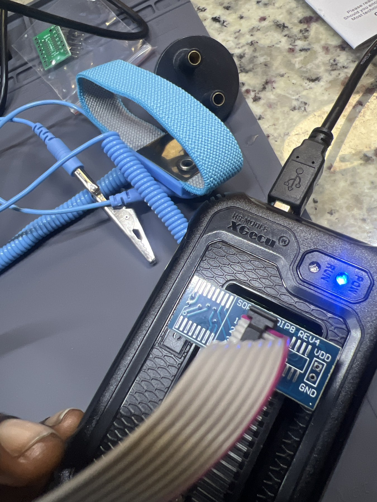
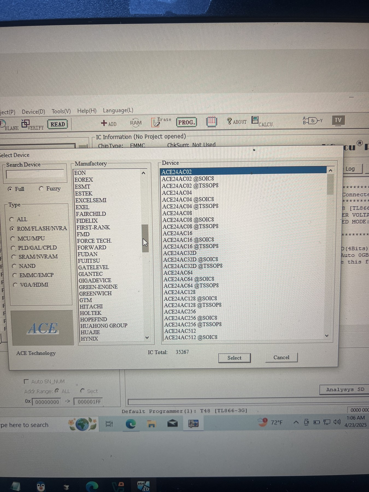

# Pixhawk Flight Control System Vulnerability Research

---

## Objective

The objective of this project was to study a hardware-assisted firmware extraction workflow that can support security research on embedded systems such as Pixhawk-based flight controllers.

I built a controlled electronics lab, opened a test device, inspected its circuit board, identified possible memory components, and prepared an XGecu T48 universal programmer with the correct adapter. I also used the programmer software to compare supported flash-device families before attempting a binary read, then documented a preliminary raw-binary import and disassembly exercise in IDA Pro.

The hardware shown in these photographs is a research test device used to practice the extraction method. It is not presented as a Pixhawk flight controller. The same careful process—documenting the board, identifying the exact memory chip, confirming pinout and voltage requirements, selecting the correct device profile, and preserving the original binary—can be applied during authorized Pixhawk firmware research.

This project focused on safe acquisition and documentation. It does not claim that a vulnerability was discovered or that a successful Pixhawk firmware modification was performed.

---

## Skills Learned

- Prepared a controlled workspace for embedded hardware research.
- Disassembled an electronic device while documenting the original layout.
- Inspected a circuit board and integrated circuits under magnification.
- Researched flash-memory package types, pinouts, and programmer compatibility.
- Configured an XGecu T48 universal programmer and SOIC adapter.
- Compared supported EEPROM, SPI flash, and eMMC device profiles.
- Practiced a repeatable workflow for acquiring firmware binaries.
- Learned to preserve an original dump before beginning static analysis.
- Imported a raw binary into IDA Pro for preliminary static analysis.
- Learned why processor architecture, bitness, load address, and entry point must be validated manually for raw firmware.
- Improved understanding of embedded-system attack surfaces and hardware trust boundaries.
- Practiced documenting security research without overstating results.

---

## Tools Used

- XGecu T48 universal programmer
- XGecu programmer software
- SOIC/DIP adapter board
- IC test clip and ribbon cable
- USB connection
- Digital microscope
- Precision screwdriver and electronics tools
- Antistatic wrist strap and grounding lead
- Windows research workstation
- Embedded test device
- IDA Pro

---

## Steps

Every photograph includes a short explanation of what is being shown.

### Ref 1: Research Workspace and Inspection Equipment

This photograph shows the initial workspace with the digital microscope, electronics tools, antistatic equipment, adapters, and computer prepared before disassembly. Organizing the equipment first reduces handling mistakes and helps keep the extraction process repeatable.

---

### Ref 2: Controlled Device Teardown

This photograph shows the test device after its enclosure was opened. The housing, fasteners, wiring, and board position were kept visible so the device could be documented and reassembled correctly.

---

### Ref 3: Circuit Board Removal

This photograph shows the circuit board lifted from the enclosure for closer inspection. The board was handled carefully so that connectors, antenna leads, and power wiring were not damaged during access.

---

### Ref 4: Microscope-Based Board Inspection

This photograph shows the board positioned beneath the digital microscope. Magnification was used to examine component markings, orientation indicators, solder joints, and possible memory devices before connecting any programmer.

---

### Ref 5: Integrated Circuit Close-Up

This photograph shows a close-up view of an integrated circuit package. Reading the complete chip marking and locating the pin-one indicator are necessary before choosing an adapter, voltage, or device profile.

---

### Ref 6: Complete Firmware Research Setup

This photograph shows the complete research setup with the microscope, programmer, adapters, test leads, electronics tools, and Windows workstation. The arrangement supports visual verification before a read operation is attempted.

---

### Ref 7: SPI Flash Device Profile Selection

This photograph shows the XGecu software displaying XMC XM25QH64-series SPI flash profiles. Package type and exact part number must match the physical chip because an incorrect profile can produce invalid data or unsafe electrical settings.

---

### Ref 8: XGecu T48 and Adapter Connection

This photograph shows the powered XGecu T48 with a SOIC/DIP adapter and ribbon cable. The adapter provides the physical interface needed to connect a compatible flash package or test clip to the programmer.

---

### Ref 9: Comparing Supported Memory Families

This photograph shows the programmer software's device database with ROM, flash, NVRAM, and eMMC-related options. The database was reviewed to understand which memory families and package variants the programmer supports before selecting a final read configuration.

---

### Ref 10: IDA Pro Binary Analysis Report

[Open the IDA Binary Analysis Report (PDF)](files/pixhawk/ida-binary-report.pdf)

This four-page collaborative report documents opening an `FM25V10-G@SOIC8` raw binary in IDA Pro, loading it as a binary file, selecting a processor and disassembly mode, responding to the missing-entry-point notice, and viewing an initial disassembly.

Because raw firmware does not contain the metadata available in a normal executable, the MetaPC processor choice, 32-bit mode, load address, and apparent x86 instructions shown in the report are preliminary analyst selections rather than confirmed properties of the memory image. The next analysis step would be to identify the original device's processor and memory map, validate the dump format and entropy, locate recognizable data structures or vectors, and reload the image with the correct architecture and addressing.

---

## My Contribution

My main contributions were:

- Planned and assembled the embedded hardware research workspace.
- Performed the controlled teardown of the research device.
- Removed and inspected the circuit board under magnification.
- Researched possible flash-memory components and package variants.
- Configured the XGecu T48 programmer, adapter, and software.
- Compared supported device profiles before attempting binary acquisition.
- Collaborated on the IDA Pro raw-binary import and preliminary analysis report.
- Documented the physical setup and each stage of the workflow.
- Connected the practical extraction process to authorized Pixhawk firmware research.

---

## Summary

This project helped me understand that embedded security analysis begins before a binary reaches a reverse-engineering tool. Reliable firmware research depends on careful teardown, exact component identification, correct electrical settings, compatible adapters, and preservation of the original data.

By practicing the workflow on a research test device and documenting the preliminary IDA Pro import, I developed a safer and more repeatable method for future analysis of Pixhawk-based flight-control hardware and other embedded systems. The exercise also showed why raw disassembly output must be validated against the target hardware before it is treated as meaningful code.
