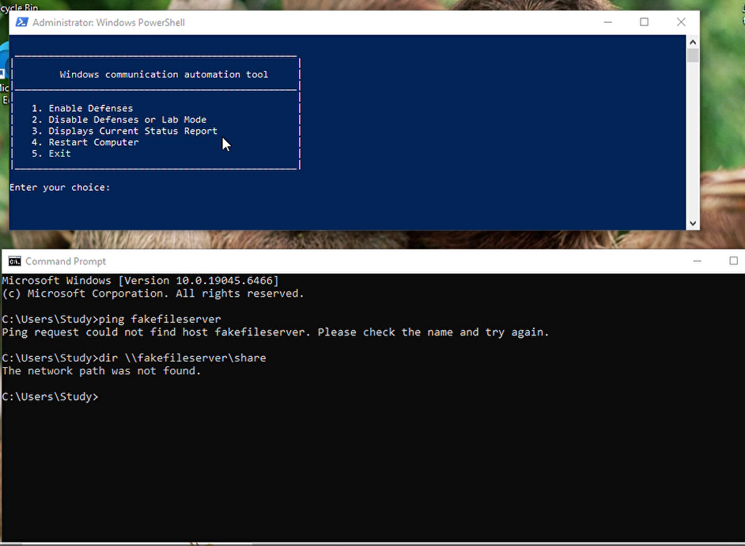
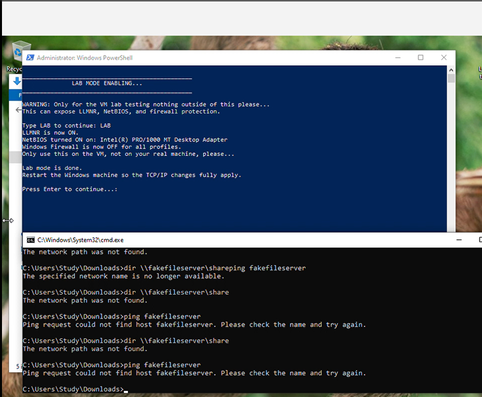
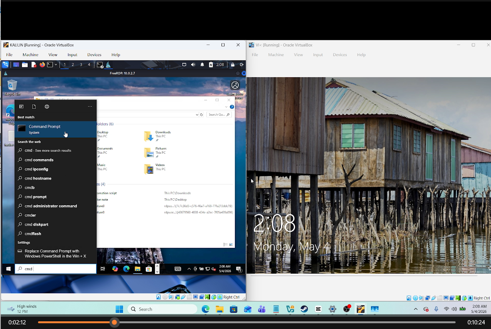
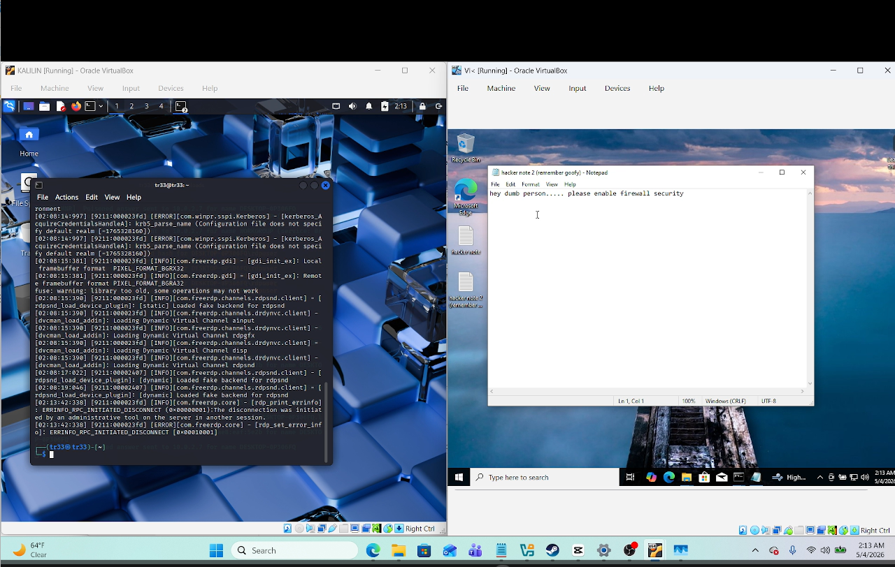
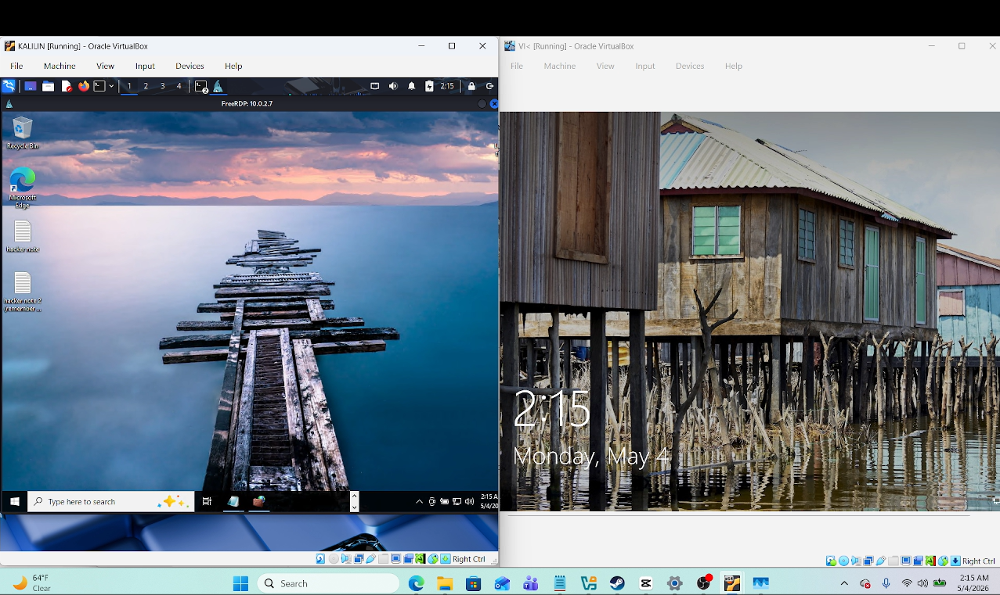

# RDP Security Lab

---

## Objective

The objective of this project was to understand how Windows name-resolution settings and Remote Desktop Protocol access can affect security inside an isolated virtual lab.

I used a Windows victim virtual machine and a Kali Linux testing virtual machine in Oracle VirtualBox. On Windows, I tested a PowerShell automation tool that can enable defensive settings or place the machine into a deliberately vulnerable lab mode. Lab mode enabled LLMNR and NetBIOS and disabled Windows Firewall so I could observe the risks created by weaker network controls.

From Kali Linux, I used Responder during the name-resolution test and FreeRDP to connect to the Windows system with an authorized lab account. I confirmed the remote session, demonstrated access by creating a harmless note, and then returned the environment to a safe state.

All activity was performed in virtual machines that I controlled. No production system, public network, or third-party account was targeted.

---

## Skills Learned

- Built an isolated Windows and Kali Linux lab in Oracle VirtualBox.
- Tested RDP connectivity between two virtual machines.
- Used FreeRDP to create an authorized remote Windows session.
- Studied how LLMNR and NetBIOS name resolution can expose authentication material.
- Used Responder in a controlled lab to observe poisoned name-resolution responses.
- Built and tested a PowerShell menu for enabling defenses or lab mode.
- Reviewed the security impact of disabling Windows Firewall.
- Verified remote-session access without modifying important system data.
- Learned why command history and screenshots must not expose passwords or authentication hashes.
- Practiced restoring defensive settings after completing a security test.

---

## Tools Used

- Oracle VirtualBox
- Windows 10 virtual machine
- Kali Linux virtual machine
- Remote Desktop Protocol (RDP)
- FreeRDP
- Responder
- PowerShell
- Windows Firewall
- LLMNR and NetBIOS configuration
- Command Prompt

---

## Steps

Every published screenshot includes a short explanation of what is being shown. Screenshots containing a lab password or captured NTLMv2 challenge-response were intentionally excluded from the public portfolio.

### Ref 1: Windows Defense Automation Menu

This screenshot shows the PowerShell menu used to enable defenses, enter lab mode, display the current status, or restart the Windows virtual machine. The command prompt below it shows an unsuccessful attempt to reach a deliberately named file server before the vulnerable configuration was active.

---

### Ref 2: Deliberately Vulnerable Lab Mode

This screenshot shows the script enabling LLMNR and NetBIOS and disabling Windows Firewall on the Windows VM. The script clearly warns that this mode is only for controlled testing and that the machine should be restarted so the TCP/IP changes fully apply.

---

### Ref 3: Authorized FreeRDP Session

This screenshot shows Kali Linux displaying a successful FreeRDP session to the Windows VM at `10.0.2.7`. The Windows lock screen remains visible in the second VirtualBox window, demonstrating the relationship between the local console and the active remote session.

---

### Ref 4: Remote Access Verification

This screenshot shows a harmless note created through the authorized remote session. The note confirms that remote access worked and reminds the lab operator to re-enable firewall security after the exercise.

---

### Ref 5: Final Lab State

This screenshot shows the remote Windows desktop on the Kali side and the victim VM lock screen on the other side. It documents the final state of the two-machine RDP test before defensive settings were restored.

---

## My Contribution

My main contributions were:

- Built and configured the Windows and Kali Linux virtual machines.
- Tested the PowerShell defense and lab-mode workflow.
- Enabled the vulnerable settings only inside the isolated lab.
- Observed LLMNR and NetBIOS behavior with Responder.
- Connected to the Windows VM through FreeRDP using an authorized lab account.
- Verified remote access with a harmless note.
- Documented the lab while excluding screenshots that exposed credential material.
- Reviewed the need to restore Windows Firewall and other defensive settings after testing.

---

## Summary

This project helped me understand the connection between Windows name resolution, credential exposure, firewall configuration, and RDP access. The lab demonstrated how deliberately weakened settings can create opportunities for credential interception and remote access, while also showing why those settings must be isolated, documented, and reversed when testing is complete.

The most important lesson was that successful technical testing is only part of the work. Safe lab boundaries, credential hygiene, evidence handling, and restoration of defensive controls are equally important parts of a professional security assessment.
