# Web Application Security Practice Labs

---

## Objective

The objective of this project was to practice web application security testing by using Burp Suite to inspect requests, map application endpoints, review client-side behavior, and identify common web security weaknesses in environments I owned or was authorized to test.

This project included two testing targets:

- A personal domain, `ignixeim.com`, used to inspect real request and response behavior from a deployed website.
- A local training application called NovaBank, hosted at `127.0.0.1:8000`, which was intentionally built as a fake static web application for local web security practice.

For the personal domain, I used Burp Suite to inspect the site map, request headers, cookies, static assets, JSON responses, and exposed runtime files. One important observation was that cookie material appeared in the request flow and appeared tied to access or authorization behavior. If a session cookie or authorization cookie is exposed, reusable, or not properly protected, it can become a serious weakness because an attacker may be able to act inside the website under that session's privileges.

For the NovaBank lab, I hosted a static local website with Python and used Burp Suite to map routes, inspect endpoints, test login behavior, and review how the frontend handled authentication-like behavior. The static JavaScript and local Python hosting setup did not provide a true backend login handler, which helped show the difference between frontend-only behavior and real server-side authorization. I also used Burp Suite Intruder and Repeater to test field inputs, payload positions, error behavior, and whether suspicious input such as a single quote (`'`) caused meaningful server-side differences.

This work was performed only against my own domain and my own local lab environment.

---

## Skills Learned

- Used Burp Suite Proxy to capture web traffic.
- Built a Burp Suite site map from application browsing.
- Reviewed HTTP request and response headers.
- Inspected cookies and session-related request behavior.
- Identified exposed static files, JSON files, runtime assets, and public endpoints.
- Used Burp Suite Intruder to set payload positions and compare responses.
- Used Burp Suite Repeater to manually test individual requests and input behavior.
- Tested login fields with malformed input such as a single quote (`'`) to check for injection-style behavior.
- Compared frontend-only authentication logic with real server-side authorization.
- Practiced OWASP-style analysis for broken access control, authentication weaknesses, injection testing, and security misconfiguration.
- Documented findings with safe redaction of sensitive cookie and request data.

---

## Tools Used

- Burp Suite Community Edition
- Burp Suite Proxy
- Burp Suite Target / Site Map
- Burp Suite Intruder
- Burp Suite Repeater
- Chrome Developer Tools
- Python local HTTP server
- Localhost testing at `127.0.0.1:8000`
- Personal domain testing on `ignixeim.com`
- OWASP Top 10 security categories

---

## Steps

Every screenshot includes a short explanation of what is being shown. Screenshots from the live personal domain were redacted where cookie values, live request values, or sensitive request details appeared.

### Ref 1: Real Domain Cookie Review in Burp Intruder

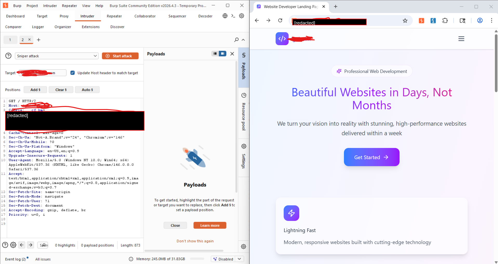

This screenshot shows Burp Suite Intruder being used against my personal domain. The request includes cookie material in the HTTP request flow. The actual cookie value was redacted before publishing.

The security concern is that if a cookie is used as an authorization key and that cookie is exposed, reusable, or not properly protected, it may allow session misuse. In a real application, this can become a broken access control or session-management issue because the cookie may represent the user's access inside the site.

---

### Ref 2: Real Domain Site Map and JSON Response Review

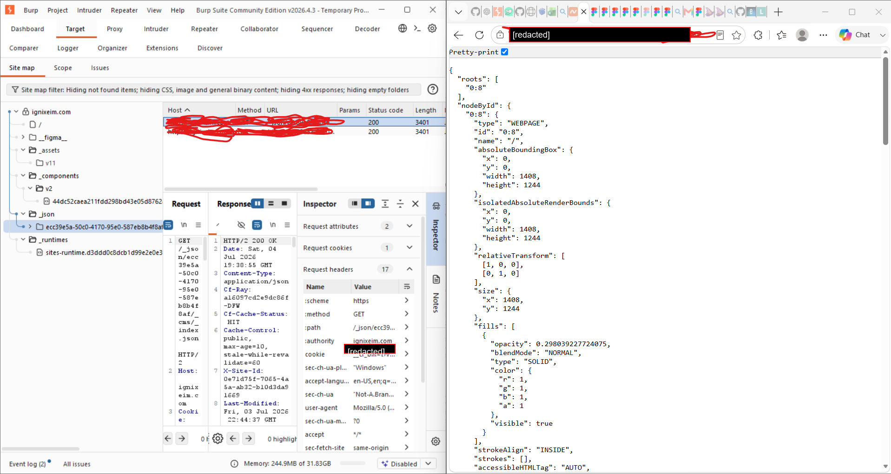

This screenshot shows Burp Suite mapping files and JSON resources from `ignixeim.com`. The browser displays a JSON response containing page data, while Burp shows the related request, response, and request-inspector details.

This helped me understand what backend or generated content was being returned to the browser and whether any public JSON responses exposed more information than intended.

---

### Ref 3: Runtime and Static Asset Exposure

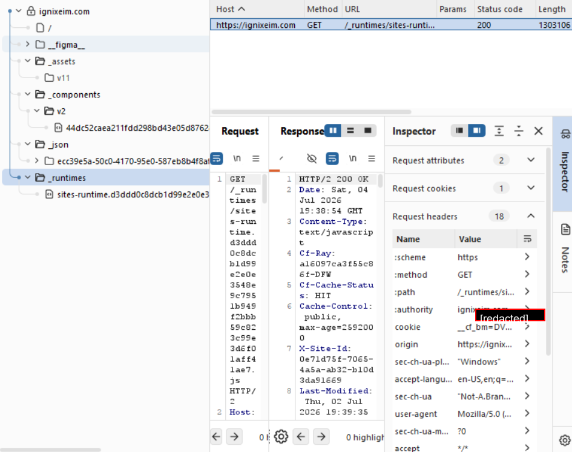

This screenshot shows Burp Suite identifying a publicly reachable runtime JavaScript file under the personal domain. Static files are not automatically vulnerable, but runtime assets and generated files should be reviewed because they may reveal application structure, internal paths, framework behavior, or client-side logic.

The main lesson from this finding was that public assets should be intentionally exposed, minimized, and reviewed before deployment.

---

### Ref 4: NovaBank Local Site Mapping

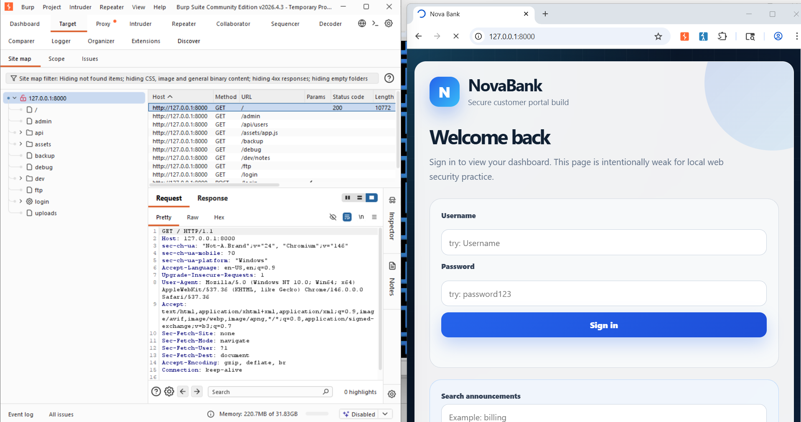

This screenshot shows the NovaBank local practice site at `127.0.0.1:8000`. Burp Suite discovered multiple routes, including `/admin`, `/api/users`, `/backup`, `/debug`, `/dev/notes`, `/ftp`, `/login`, and `/uploads`.

The site map helped identify which endpoints existed and which ones should not be publicly reachable in a real application.

---

### Ref 5: Backup Endpoint Accessed

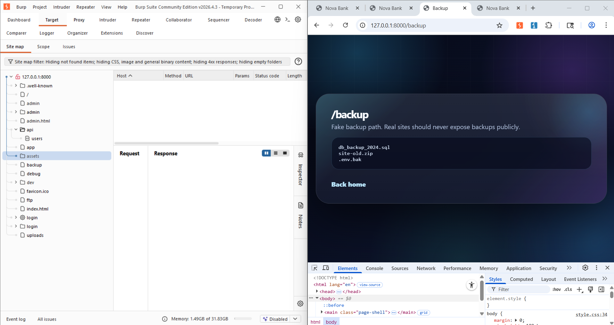

This screenshot shows the `/backup` endpoint in the NovaBank lab. It displays example backup-style filenames such as database backup and old site archive names.

In a real application, exposed backups can be dangerous because they may contain source code, environment files, database dumps, old credentials, or configuration secrets. This finding maps closely to security misconfiguration and sensitive data exposure concerns.

---

### Ref 6: API User Data Exposure

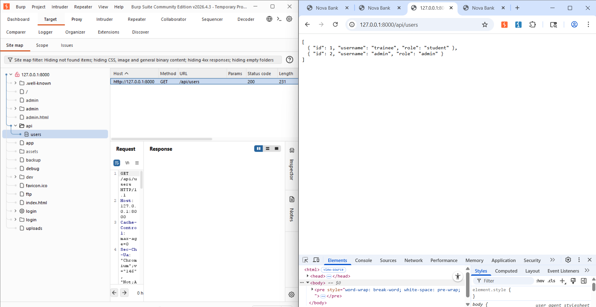

This screenshot shows the `/api/users` endpoint returning user and role information. In the lab, this was intentionally exposed so I could practice finding unprotected API endpoints.

In a real application, user and role data should require authorization. Public access to this type of endpoint can reveal account names, roles, and authorization structure that could support further attacks.

---

### Ref 7: Debug Endpoint Accessed

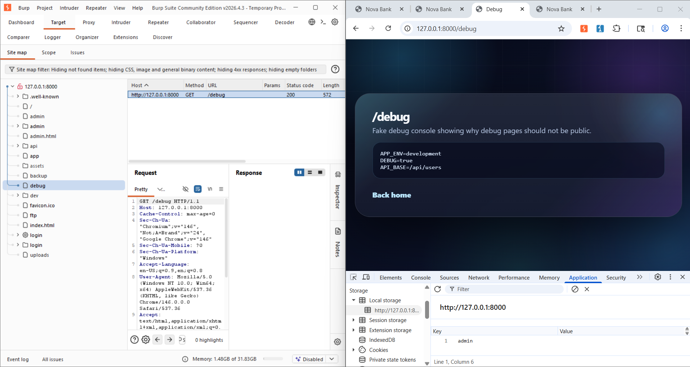

This screenshot shows the `/debug` endpoint exposing example environment and configuration-style information. Debug pages are useful during development, but they should not be available in production.

This maps to OWASP-style security misconfiguration because debug information can reveal application mode, API paths, environment names, and other internal details.

---

### Ref 8: Developer Notes Exposed

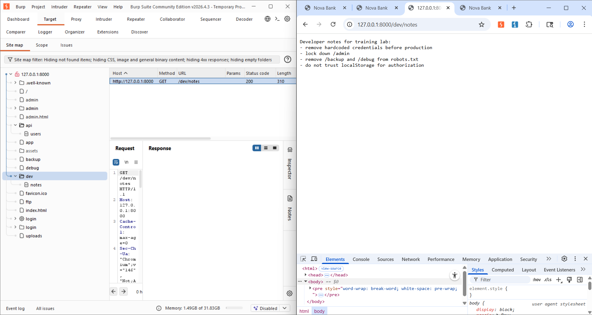

This screenshot shows the `/dev/notes` endpoint. The page includes development notes reminding the developer to remove hardcoded credentials, lock down admin access, remove backup and debug routes, and avoid trusting local storage for authorization.

This finding shows how development notes can accidentally disclose the exact weaknesses an attacker should try next. In a production application, notes like this should not be deployed publicly.

---

### Ref 9: FTP-Style Directory Exposure

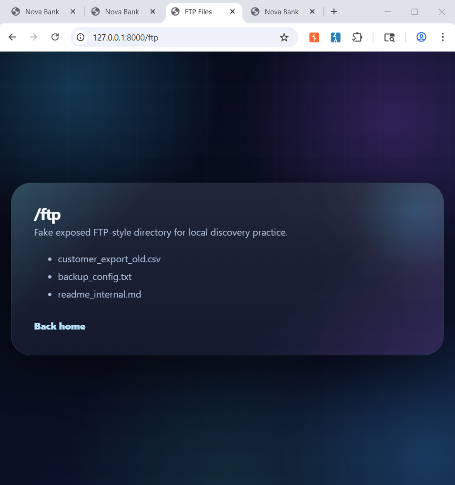

This screenshot shows a fake `/ftp` directory that lists internal-looking files. In the lab, this was used for discovery practice.

In a real application, directory listings and old export files should be blocked or moved outside the web root. Exposed file listings can lead to sensitive information disclosure.

---

### Ref 10: Upload Directory Exposure

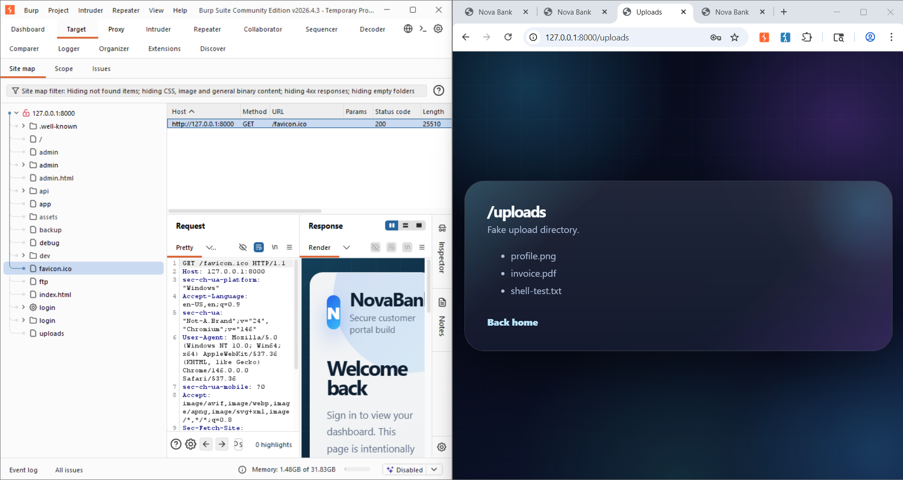

This screenshot shows the `/uploads` endpoint listing example uploaded files. Upload directories can be risky when they expose files publicly or allow unsafe file types.

For a real application, uploads should be validated, stored safely, renamed, scanned where appropriate, and served with strict permissions.

---

### Ref 11: Intruder Payload Position Testing

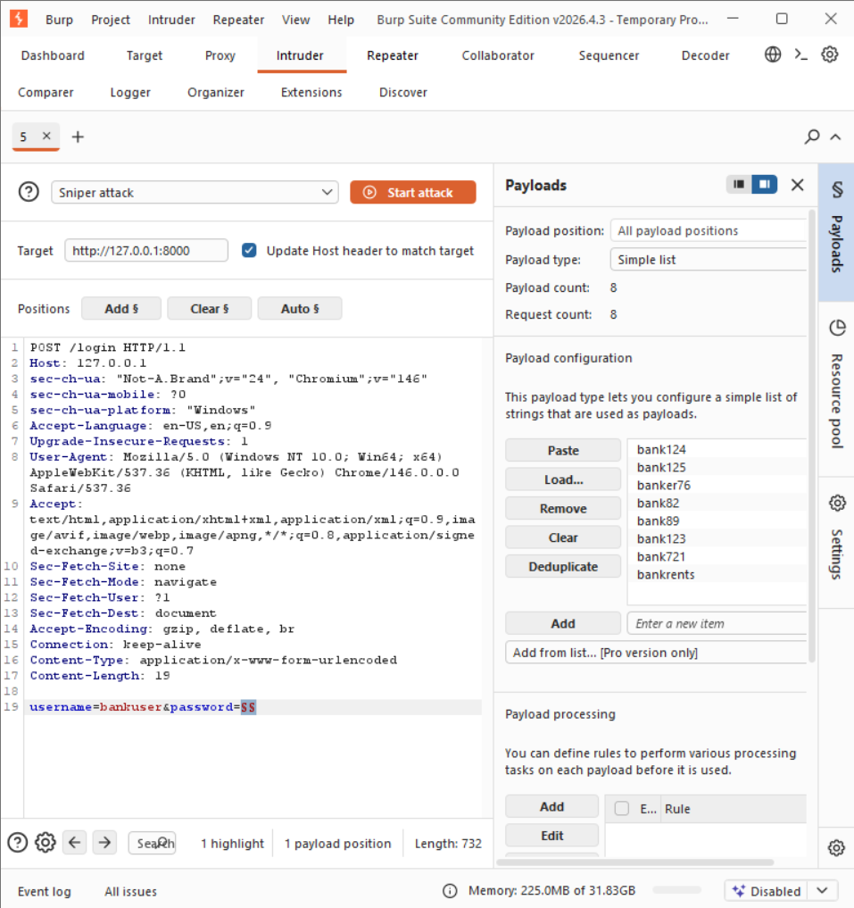

This screenshot shows Burp Suite Intruder configured with a payload position inside a login request. I used this workflow to test individual password values and compare server responses.

This was useful for understanding how payload positions work and how response length, status code, and response content can be compared across test cases. Because NovaBank was hosted as a static local site, the test also showed that a frontend login form does not prove real server-side authentication exists.

---

### Ref 12: Intruder Result Comparison

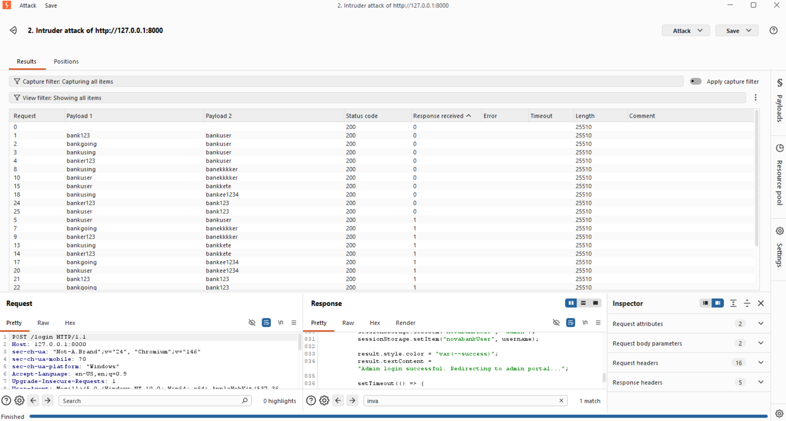

This screenshot shows Intruder results from testing multiple username and password combinations against the NovaBank login route. The responses were compared by status code, response length, and returned content.

The important finding was not just the credential testing itself. The key lesson was that repeated identical responses can reveal missing or weak backend handling. In this lab, the Python static server and frontend JavaScript did not represent a complete server-side authentication flow, so the application behavior had to be interpreted as a frontend/static design weakness rather than a confirmed database-backed login bypass.

---

## Findings

### Personal Domain Findings

- Burp Suite identified public static assets, JSON files, runtime files, and component paths.
- Cookie material appeared in the request flow and appeared tied to access or authorization behavior.
- If the cookie is reusable or insufficiently protected, it could allow session misuse under the affected user's privileges.
- Public runtime and generated files may reveal application structure or client-side implementation details.
- Potential client-side URL or DOM-based behavior should be reviewed for XSS risk, especially if user-controlled values can be reflected or executed in the browser.

### NovaBank Local Lab Findings

- Burp Suite mapped multiple sensitive-looking endpoints on the local practice site.
- `/backup`, `/debug`, `/dev/notes`, `/ftp`, `/uploads`, and `/api/users` were reachable in the local lab.
- The site exposed user and role data through an API-style endpoint.
- Development notes revealed security tasks and weaknesses that would be dangerous on a real site.
- The login workflow appeared frontend/static and was not backed by a proper server-side authentication handler.
- Repeated status codes and response lengths during Intruder testing showed that the local Python static server was not processing login attempts like a real backend application.
- Injection-style tests using characters such as `'` were useful for checking input handling, but no real database-backed SQL injection was confirmed in the static local setup.

---

## OWASP Mapping

This project connects to several OWASP Top 10 categories:

- Broken Access Control: exposed endpoints and authorization-related cookie concerns.
- Identification and Authentication Failures: frontend-only login behavior and weak session handling concerns.
- Injection: testing input fields with malformed characters such as `'` to check for SQL-injection-style behavior.
- Security Misconfiguration: exposed debug pages, backup routes, development notes, and public file listings.
- Insecure Design: relying on client-side/static behavior instead of server-side authorization enforcement.
- Cryptographic Failures / Sensitive Data Exposure: exposed cookie material, user data, and internal file references.

Reference: [OWASP Top 10](https://owasp.org/Top10/)

---

## Mitigations

### For the Personal Domain

- Store session cookies using `HttpOnly`, `Secure`, and appropriate `SameSite` settings.
- Never treat a client-side cookie value as authorization by itself; validate the session server-side.
- Rotate and expire session tokens after login, logout, password changes, and suspicious activity.
- Avoid exposing unnecessary generated JSON, internal component paths, or runtime files.
- Minimize public JavaScript bundles and remove source maps or debug output from production when not needed.
- Validate and encode user-controlled URL or DOM values to reduce client-side XSS risk.
- Add Content Security Policy protections to reduce the impact of script injection.
- Review authorization checks on every protected route and API response.

### For the NovaBank Local Lab

- Replace frontend-only login logic with a real server-side authentication handler.
- Do not store authorization decisions only in local storage or client-side JavaScript.
- Protect `/admin`, `/api/users`, `/backup`, `/debug`, `/dev/notes`, `/ftp`, and `/uploads` with proper authentication and authorization.
- Remove debug and development-note endpoints before deployment.
- Move backups, exports, and configuration files outside the public web root.
- Disable directory listing and block direct access to internal files.
- Validate upload file types, rename uploaded files, store uploads safely, and restrict execution permissions.
- Use parameterized database queries if a real database-backed login is added.
- Return consistent but meaningful error handling without exposing stack traces or internal configuration.

---

## My Contribution

My main contributions were:

- Built and hosted the NovaBank local practice website for controlled testing.
- Used Burp Suite to map both the local lab and my personal domain.
- Identified exposed routes, static files, JSON files, and runtime resources.
- Reviewed cookie behavior and request headers on the personal domain.
- Used Burp Suite Intruder to configure payload positions and compare login responses.
- Used Burp Suite Repeater to manually test requests and field behavior.
- Tested malformed input such as `'` to check for injection-style response differences.
- Interpreted repeated response behavior from the static Python server and explained why it was not a complete backend authentication flow.
- Documented findings using OWASP-style categories and mitigation recommendations.

---

## Summary

This project helped me practice web application security testing in both a live personal-domain environment and a controlled local lab. The personal-domain testing helped me understand how cookies, JSON responses, runtime assets, and site-map discovery appear in Burp Suite. The NovaBank lab helped me practice endpoint discovery, authorization review, static-code analysis, Intruder payload testing, Repeater testing, and OWASP-style reporting.

The biggest lesson was that web security testing is not only about finding pages that respond. It is also about understanding what the response means, whether the server is actually enforcing security, and how exposed files, cookies, endpoints, and frontend logic could affect the overall application risk.
